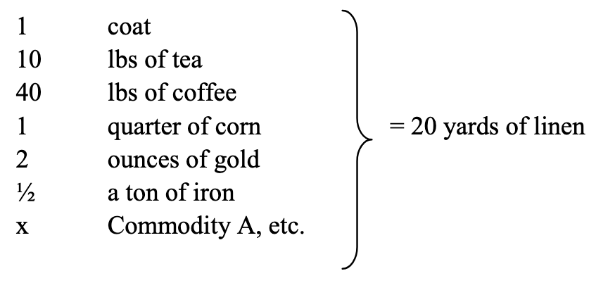

# 1. Commodities

## 1. The two factors of a commodity: Use-value and value (the substance of value and the magnitude of value)

A **commodity** is an object that satisfies a want

> *To discover the various uses of things is the work of history.*

- **use-value** is how useful something is as an object
  - use-values cannot exist abstractly, they are limited by physical properties of commodities, so commodities *are* use-values in material form
  - use-value is independent of how much labour it takes to use it
    - (<u>I think</u> this means that e.g. the extensive process required to make Niqiu edible does not affect the use-value of Niqiu, the use-value of Niqiu is determined only by the fact that we want to eat it)
  - a use-value is only realized when the object is used or consumed
  - they are the "material depositories of exchange value"
- **exchange value** is "the proportion in which values in use of one sort are exchanged for those of another sort"
  - commodities have many exchange values - one for each commodity they could be exchanged with
  - "exchange value, generally, is only the mode of expression, the phenomenal form, of something contained in it, yet distinguishable from it"
  - not the same as real prices!
- different commodities have use-values of different qualities, but their exchange values only differ in quantity
- if we look at commodities without looking at their use-values, their only common property is that they are products of labour - these are abstractly their values
  - labour can be measured by duration
  - different people can take different amounts of time to do the same labour
  - we can standardize by measuring **socially necessary labour time**
    - labour time necessary "to produce an article under the normal conditions of production, and with the average degree of skill and intensity prevalent at the time"
- socially necessary labour time can change depending on nature and the productiveness of labour
  - average skill of workers
  - science
  - engineering
  - social organization of production
  - physical conditions
- things can have 0 value
  - use-value but no value
    - things that are useful but not produced by labour
      - air
    - things that are useful but not commodities
      - things that are not exchanged in order to be used
  - things that are useless

## 2. The two-fold character of the labour embodied in commodities

- labour posseses "the same two-fold nature": useful labour (creates use-values - how and what?) and abstract labour power (determines exchange value - how much? how long a time?)
- "the value of a commodity represents human labour in the abstract"
  - skilled labour is nothing but intensified simple labour - it is not of a different quality
  - value is comparable between commodities when abstracting away use-values - this is analogous to  considering labour power after abstracting away different types of labour

## 3. The form of value, or exchange value

this section shows how the abstract discussion of value leads back to the familiar money form. It demystifies value as a phenomenon in commodity exchange that comes from labour, as opposed to being a natural characteristic.

> *So far no chemist has ever discovered exchange value either in a pearl or a diamond.*

- it is impossible to express the value of a commodity in itself
  - "20 yards of linen = 20 yards of linen" statement dreamed up by the utterly deranged
  - value has a "purely social reality" of human labour, so it "can only manifest itself in the social relation of commodity to commodity"

### Elementary/accidental form of value

- *"Hence, in the value equation, in which the coat is the equivalent of the linen, the coat officiates as*
  *the form of value. The value of the commodity linen is expressed by the bodily form of the*
  *commodity coat, the value of one by the use value of the other. As a use value, the linen is*
  *something palpably different from the coat; as value, it is the same as the coat, and now has the*
  *appearance of a coat. Thus the linen acquires a value form different from its physical form. The*
  *fact that it is value, is made manifest by its equality with the coat, just as the sheep’s nature of a*
  *Christian is shown in his resemblance to the Lamb of God."*
  - the value of the linen is shown in the use-value of the coat
  - the coat can show the value of the linen because it has been laboured on, but the particular form of that labour doesn't matter
  - Q: If something does not have use-value, can it be used as an equivalent? A: No
- the two poles of the expression of value are the **relative form** and the **equivalent form**
  - the value of $x$ amount of commodity $A$ must be expressed relative to $y$ amount of commodity $B$
  - in this expression, the value of $A$ is *relative* to $B$, and $B$ serves only as an *equivalent* for $A$ so its own value is not expressed
  - $B$ is the "congealed form of human labour" that is used as a unit for the value of $A$
    - using $B$ as an equivalent is expressing "the fact that it is directly exchangeable with other commodities"
    - > *The first peculiarity that strikes us in considering the form of the equivalent is this: use-value becomes the form of manifestation, the phenomenal form of its opposite, value."*
    - > *Hence, the second peculiarity of the equivalent form is, that concrete labour becomes the form under which its opposite, abstract human labour, manifests itself.*
      
      - the individual labour of one person takes the form of general labour of society
      - the specific act of e.g. making linen is compared to anyone working in general
    - > *We have then a third peculiarity of the equivalent form, namely, that the labour of private individuals takes the form of its opposite, labour directly social in its form.*

- the expression of value is not symmetric
  - in the statement ""$x$ of commodity $A$ is worth $y$ of commodity $B$", $A$ is in the relative form and $B$ the equivalent, and the value of $A$ is being expressed but not $B$
  - the symmetric statement expressing the value of $B$ follows logically, but it is different as an expression of value
  - the equivalent is the "mode of existence of value", is "value embodied", is a congelation of labour
    - the value of $A$, expressed in the use-value of $B$, has taken the form of relative value
- quantities can be compared when they are of the same unit - $x$ linen = $y$ coat implies that linen and coat have the same unit
  - the equivalent is kind of like a unit of human labour in the abstract

### Total/expanded form of value

- using transitivity to compare multiple values
- just like the equivalent form, but now it doesn't seem accidental - shows that all commodities can be in relationship with each other
- shows that value isn't caused by the incidence of exchange
  - e.g. bananas 🍌 don't tend to be exchanged with ICBMs ​🚀​ but they can be put in the same expanded form equation
  - impossible to have a general form if value isn't a consistent property
    - e.g. if 20 yds linen = 1 coat and 20 yds linen = 1 lb tea in exchange, but 1 coat isn't exchanged for 1 lb tea, then expanded form would be impossible (and value wouldn't really exist)

### General form/money form of value

- the universal equivalent "loses its use-value" (because it is an equivalent), but it could only be an equivalent BECAUSE it has use-value, i.e. because it is just another commodity
- socially we understand that it (e.g. gold) is being used to communicate the value of everything else
- allows the world of commodities to be understood altogether, as a system of things with *value*, as opposed to just *exchange values* that can be compared with each other
- the money form is not really different from the general form - getting rid of money doesn't get rid of value, just makes trade harder
  - > *Our analysis has shown, that the form or expression of the value of a commodity originates in the**
    > *nature of value, and not that value and its magnitude originate in the mode of their expression as*
    > *exchange value. This, however, is the delusion as well of the mercantilists and their recent*
    > *revivers, Ferrier, Ganilh, 23 and others, as also of their antipodes, the modern bagmen of Free-*
    > *trade, such as Bastiat. The mercantilists lay special stress on the qualitative aspect of the*
    > *expression of value, and consequently on the equivalent form of commodities, which attains its*
    > **full perfection in money.*
    
    - the mercantilists' focus in economics is the value of money itself
    - wtf do this mean?

## 4. The fetishism of commodities and the secret thereof

People get really horny over commodities

(note: Robinson Crusoe is a story about a guy deserted on an island)

- > *Those ancient social organisms of production are, as compared with bourgeois society, extremely simple and transparent. But they are founded either on the immature development of man individually, who has not yet severed the umbilical cord that unites him with his fellowmen in a primitive tribal community, or upon direct relations of subjection. They can arise and exist only when the development of the productive power of labour has not risen beyond a low stage, and when, therefore, the social relations within the sphere of material life, between man and man, and between man and Nature, are correspondingly narrow. This narrowness is reflected in the ancient worship of Nature, and in the other elements of the popular religions. The religious reflex of the real world can, in any case, only then finally vanish, when the practical relations of every day life offer to man none but perfectly intelligible and reasonable relations with regard to his fellowmen and to Nature.*

  - people need religion to make sense of the social relations and aspects of nature that don't fully make sense to them - just like how people fetishize commodities because they don't understand economics
- money abstracts away the reality that labour creates value
- who is Dogberry ?

- > *Hence, when we bring the products of our labour into relation with each other as values, it is not because we see in these articles the material receptacles of homogeneous human labour. Quite the contrary: whenever, by an exchange, we equate as values our different products, by that very act, we also equate, as human labour, the different kinds of labour expended upon them. We are not aware of this, nevertheless we do it.*

  - when we exchange things, it's not because we are consciously equating the labour put into those things
  - value (and hence labour time) comes up because we exchange things

- >  *A commodity is therefore a mysterious thing, simply because in it the social character of men’s labour appears to them as an objective character stamped upon the product of that labour; because the relation of the producers to the sum total of their own labour is presented to them as a social relation, existing not between themselves, but between the products of their labour.*

  - we exchange objects in certain ratios, which seems like a physical quality as opposed to looking like what it is, a social construction